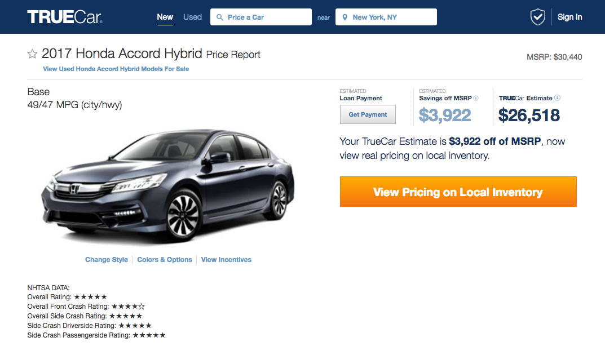

# SAFETY-ChromeExt

### Goal:  
Develop Chrome Extension with on individual car advertisement posts that has safety information from NHTSA, IIHS (hopefully).

### Current working demo:

### Team Roles:
<table>
  <tr>
    <th>Person</th>
    <th>Role</th>
    <th>Email</th>
  </tr>
  <tr>
    <td>Jerry Lei</td>
    <td>Developer</td>
    <td>jerrylei98@gmail.com</td>
  </tr>
  <tr>
    <td>Victor Wen</td>
    <td>Advertising</td>
    <td>vw514@stern.nyu.edu</td>
  </tr>
</table>

### APIs:

- cars.com (Waiting)
- IIHS (Waiting)
- NHTSA - Open API

### Available on:

- TrueCar.com (new cars)

### Log:

- October 11-12, 2016: Initial research, request API access from cars.com/iihs.org
- October 12, 2016: TrueCar new car posts have NHTSA safety ratings
