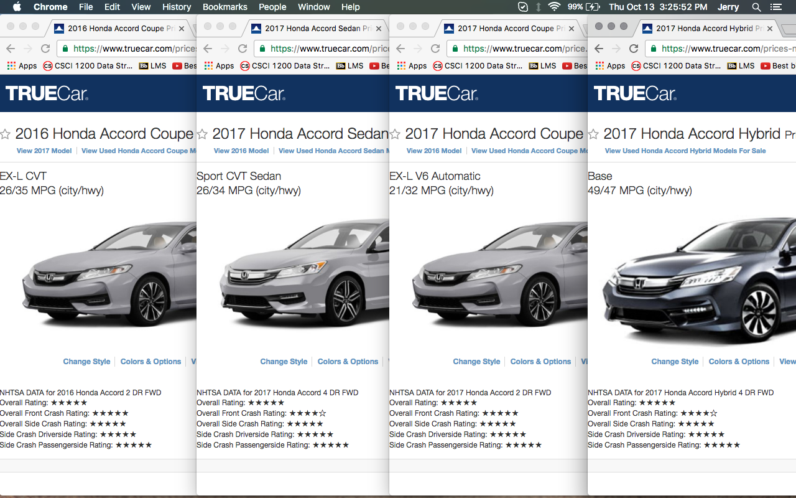
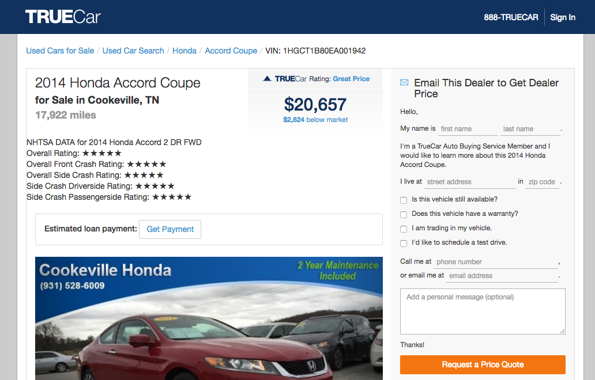
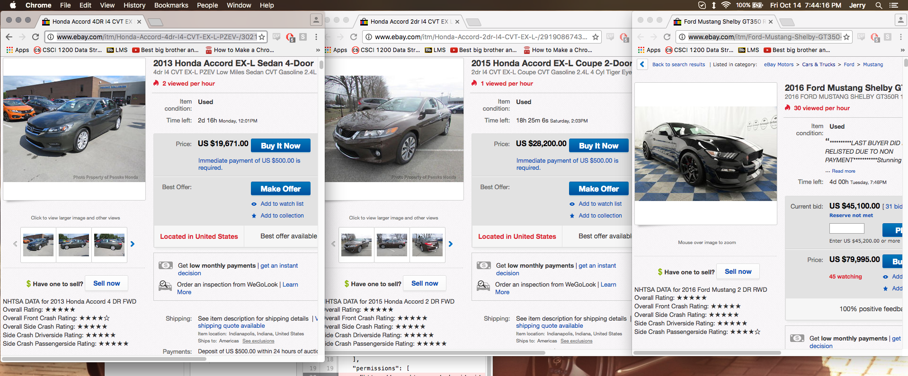

# SAFETY-ChromeExt

### Goal:  
Develop Chrome Extension with on individual car advertisement posts that has safety information from NHTSA, IIHS (hopefully).

### Current working demo:

### APIs:

- cars.com (Waiting)
- IIHS (Waiting)
- NHTSA - Open API
- eBay Motors

### Available on:

- TrueCar.com
- eBay.com

### To do:

- Figure out a way for less cluttered JS structure (do it before it gets even more cluttered.)
- TrueCar:
  - NHTSA special cases:
    - Hyundai plugin hybrid
  - Used car browsing does not require page reloading.
    - Figure out a way to reload page when advertisement is 'loaded'
- eBay Motors:
  - Better location for the data
  - Data for truck in different order than for cars (find a way to parse by looking at values)

### Log:

- October 11-12, 2016: Initial research, request API access from cars.com/iihs.org
- October 12, 2016: TrueCar new car posts have NHTSA safety ratings
- October 13, 2016: New way to get individual NHTSA safety ratings (encompasses more vehicles)
- October 14, 2016: TrueCar used data semi functional (page auto-reloads)
